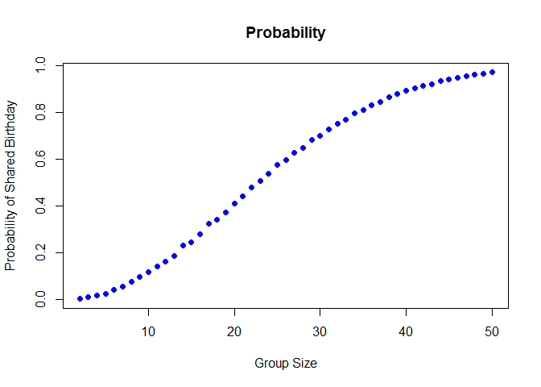
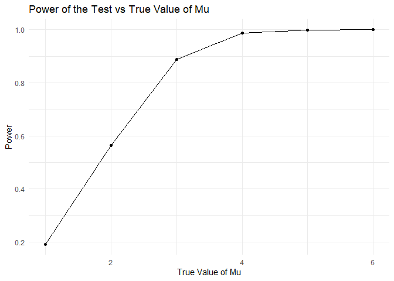
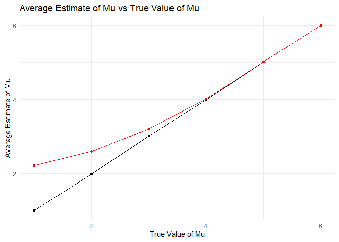
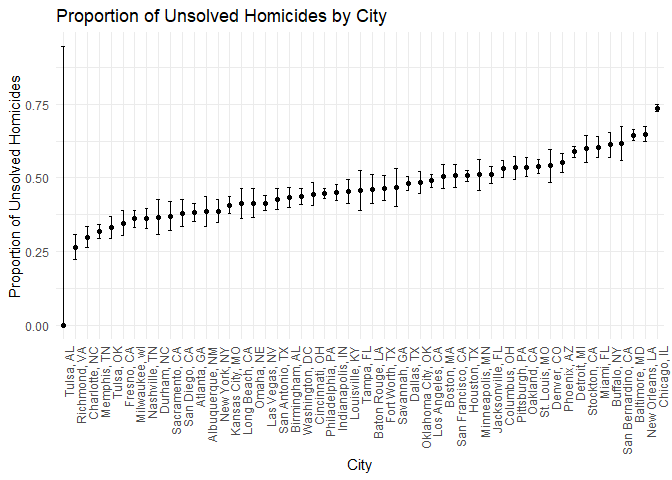

Untitled
================
2024-11-14

### Problem 1

``` r
#birthday function for duplications.
birthday <- function(n) {
  birth <- sample(1:365, n, replace = TRUE)
  any(duplicated(birth))
}
```

``` r
sizes <- 2:50
simulations <- 10000
prob <- numeric(length(sizes))

#for loop and run the function 10000 times for each group size between 2 and 50. 
for (i in seq_along(sizes)) {
  results <- replicate(simulations, birthday(sizes[i]))
  prob[i] <- mean(results)
}
```

``` r
#plot
plot(sizes, prob, type = "b", 
     xlab = "Group Size", ylab = "Probability of Shared Birthday",
     main = "Probability",
     pch = 16, col = "blue")
```

<!-- -->
Probability increase as group size increase.

### Problem 2

``` r
#simulate data and perform t-test
simulate <- function(mu, n = 30, sigma = 5, simulations = 5000) {
  p_values <- numeric(simulations)
  estimates <- numeric(simulations)
  
  for (i in 1:simulations) {
    data <- rnorm(n, mean = mu, sd = sigma)
    test <- t.test(data, mu = 0)
    p_values[i] <- test$p.value
    estimates[i] <- mean(data)
  }
  
  list(p_values = p_values, estimates = estimates)
}
```

``` r
#run the simulations for different mu
mu <- 1:6
results <- map(mu, ~ simulate(.x)) %>%
  set_names(mu)

# Combine results into one data frame
all_results <- bind_rows(results, .id = "mu") %>%
  mutate(mu = as.numeric(mu))
```

``` r
#plot showing the proportion of times the null was rejected (the power of the test) on the y axis  
#and the true value of μ on the x axis
power_data <- all_results %>%
  group_by(mu) %>%
  summarize(power = mean(p_values < 0.05))

ggplot(power_data, aes(x = mu, y = power)) +
  geom_line() +
  geom_point() +
  labs(
    title = "Power of the Test vs True Value of Mu",
    x = "True Value of Mu",
    y = "Power"
  ) +
  theme_minimal()
```

<!-- --> By
obverving the plot we can see that there is a clear positive association
between the effect size (μ) and the power of the test.

``` r
#get the average estimates
estimate_data <- all_results %>%
  group_by(mu) %>%
  summarize(
    avg_estimate = mean(estimates),
    avg_rejected = mean(estimates[p_values < 0.05], na.rm = TRUE)
  )

#overlap plot of Average Estimate of Mu vs True Value of Mu
ggplot(estimate_data, aes(x = mu)) +
  geom_line(aes(y = avg_estimate), color = "black") +
  geom_point(aes(y = avg_estimate), color = "black") +
  geom_line(aes(y = avg_rejected), color = "red") +
  geom_point(aes(y = avg_rejected), color = "red") +
  labs(
    title = "Average Estimate of Mu vs True Value of Mu",
    x = "True Value of Mu",
    y = "Average Estimate of Mu"
  ) +
  theme_minimal()
```

<!-- --> The
sample average of u hat across tests where the null is rejected is
closer to the true value of μ, but it slightly overestimates. This might
happen because the null is more likely to be rejected for larger
observed effects. In contrast, the overall average is biased downward,
especially for smaller values of μ, because it includes cases where the
effect is too small to reject the null.

### Problem 3

``` r
#load the data
homicide <- read_csv("data/homicide-data.csv")
```

    ## Rows: 52179 Columns: 12
    ## ── Column specification ────────────────────────────────────────────────────────
    ## Delimiter: ","
    ## chr (9): uid, victim_last, victim_first, victim_race, victim_age, victim_sex...
    ## dbl (3): reported_date, lat, lon
    ## 
    ## ℹ Use `spec()` to retrieve the full column specification for this data.
    ## ℹ Specify the column types or set `show_col_types = FALSE` to quiet this message.

The raw data contains a unique identifier uid for each case and a
reported_data indicate what time homicide reported. It also contains
victim information like last first name, race, age, sex. It has
geographical details with the city and state of the homicide, latitude
and longitude also included. Lastly it has information about the outcome
of the case like closed by arrest, closed without arrest, or open/no
arrest. Some data contains missing value.

``` r
homicide <- homicide %>%
  mutate(city_state = str_c(city, ", ", state)) %>%
  group_by(city_state) %>%
  summarize(
    total = n(),
    unsolved = sum(disposition %in% c("Closed without arrest", "Open/No arrest"))
  )
```

``` r
#only keep data for Baltimore, MD and run prop.test
baltimore <- filter(homicide, city_state == "Baltimore, MD")
prop <- prop.test(baltimore$unsolved, baltimore$total)

#tidy the output
prop <- tidy(prop)

#get proportion and confidence intervals
baltimore_summary <- tibble(
  city_state = "Baltimore, MD",
  proportion = prop$estimate,
  conf_low = prop$conf.low,
  conf_high = prop$conf.high
)

# Print the result
head(baltimore_summary)
```

    ## # A tibble: 1 × 4
    ##   city_state    proportion conf_low conf_high
    ##   <chr>              <dbl>    <dbl>     <dbl>
    ## 1 Baltimore, MD      0.646    0.628     0.663

``` r
# Run prop.test for each city and use purrr to tidy up the results
city_results <- homicide %>%
  mutate(
    prop_test = map2(unsolved, total, ~ prop.test(.x, .y)),
    tidy_results = map(prop_test, tidy)
  ) %>%
  unnest(tidy_results) %>%
  select(city_state, estimate, conf.low, conf.high)
```

    ## Warning: There was 1 warning in `mutate()`.
    ## ℹ In argument: `prop_test = map2(unsolved, total, ~prop.test(.x, .y))`.
    ## Caused by warning in `prop.test()`:
    ## ! Chi-squared近似算法有可能不准

``` r
head(city_results)
```

    ## # A tibble: 6 × 4
    ##   city_state      estimate conf.low conf.high
    ##   <chr>              <dbl>    <dbl>     <dbl>
    ## 1 Albuquerque, NM    0.386    0.337     0.438
    ## 2 Atlanta, GA        0.383    0.353     0.415
    ## 3 Baltimore, MD      0.646    0.628     0.663
    ## 4 Baton Rouge, LA    0.462    0.414     0.511
    ## 5 Birmingham, AL     0.434    0.399     0.469
    ## 6 Boston, MA         0.505    0.465     0.545

``` r
#make a plot with error bars (geom_errorbar)
ggplot(city_results, aes(x = reorder(city_state, estimate), y = estimate)) +
  geom_point() +
  geom_errorbar(aes(ymin = conf.low, ymax = conf.high), width = 0.3) +
  labs(
    title = "Proportion of Unsolved Homicides by City",
    x = "City",
    y = "Proportion of Unsolved Homicides"
  ) +
  theme_minimal() +
  theme(axis.text.x = element_text(angle = 90, hjust = 1))
```

<!-- -->
